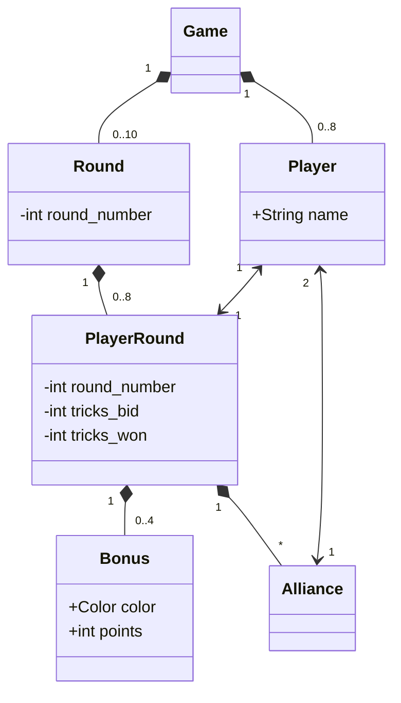

# Class Diagram

```mermaid
classDiagram
    class Game {
    }
    class Player {
        +String name
    }
    class Round {
        -int round_number
    }
    class PlayerRound {
        -int round_number
        -int tricks_bid
        -int tricks_won
    }
    class Bonus {
        +Color color
        +int points
    }
    class Alliance {
    }
    Game "1" *-- "0..8" Player
    Game "1" *-- "0..10" Round
    Round "1" *-- "0..8" PlayerRound
    PlayerRound "1" *-- "0..4" Bonus
    PlayerRound "1" *-- "*" Alliance
    Player "1" <--> "1" PlayerRound
    Player "2" <--> "1" Alliance
```